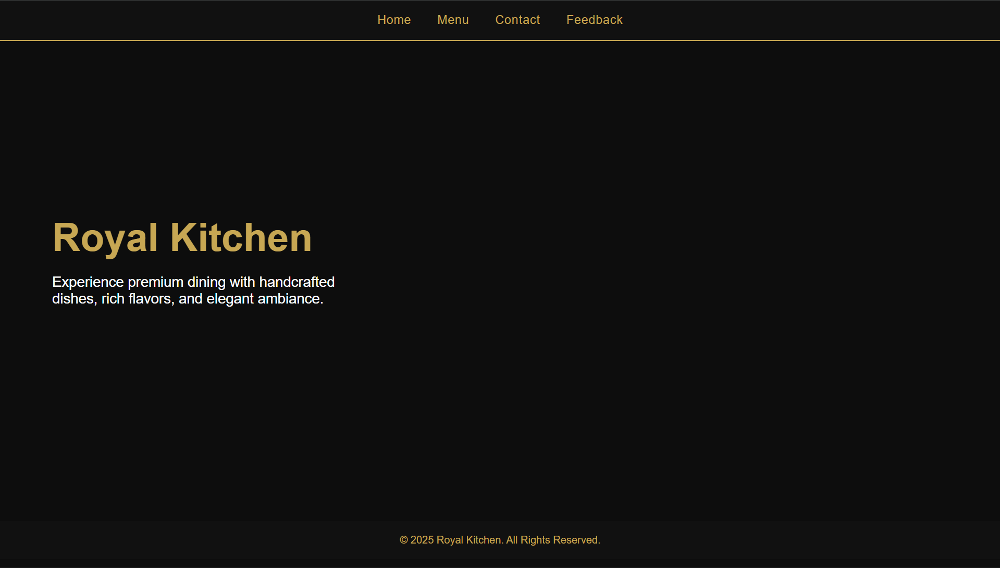
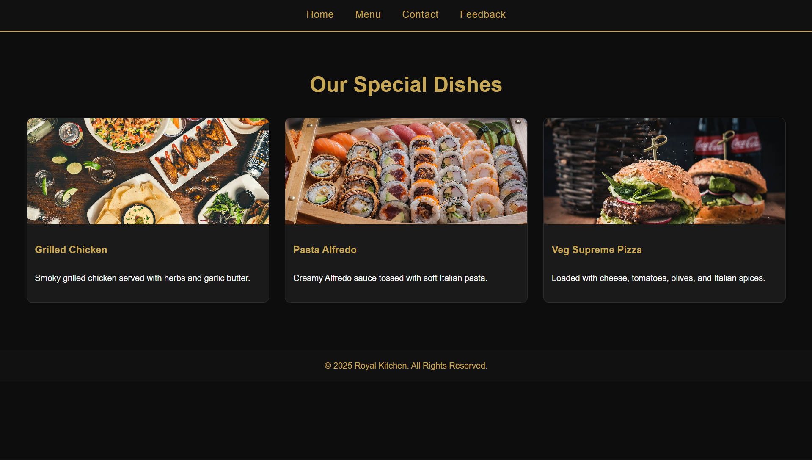
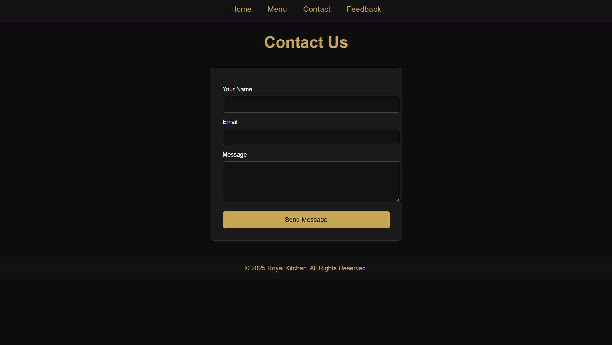
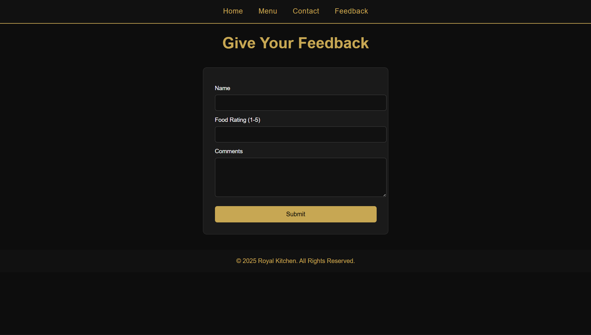

# Ex.07 Restuarant Website


## AIM:
To develop a static Resturant website to display the menu and services provided by the resturant.

## DESIGN STEPS:

### Step 1:
Requirement collection.

### Step 2:
Creating the layout using HTML and CSS.

### Step 3:
Updating the sample content.

### Step 4:
Choose the appropriate style and color scheme.

### Step 5:
Validate the layout in various browsers.

### Step 6:
Validate the HTML code.

### Step 7:
Publish the website in the given URL.

## PROGRAM:
## styles.css
```python
/* --------- GLOBAL STYLES --------- */
body {
    margin: 0;
    font-family: "Poppins", sans-serif;
    background-color: #0d0d0d;
    color: #fff;
}

header {
    background: #111;
    padding: 20px 0;
    border-bottom: 2px solid #c7a753;
}

nav {
    display: flex;
    justify-content: center;
    gap: 40px;
}

nav a {
    color: #c7a753;
    text-decoration: none;
    font-size: 18px;
    letter-spacing: 1px;
    transition: 0.3s;
}

nav a:hover {
    color: white;
}

/* --------- HERO SECTION --------- */
.hero {
    height: 80vh;
    background: url('https://images.unsplash.com/photo-1555992336-cbf8a106de0c') center/cover no-repeat;
    display: flex;
    flex-direction: column;
    justify-content: center;
    padding-left: 80px;
    color: #fff;
}

.hero h1 {
    font-size: 60px;
    margin: 0;
    color: #c7a753;
}

.hero p {
    font-size: 22px;
    max-width: 450px;
}

/* --------- MENU GRID --------- */
.menu-container {
    padding: 50px;
}

.menu-title {
    text-align: center;
    font-size: 40px;
    color: #c7a753;
}

.menu-grid {
    margin-top: 40px;
    display: grid;
    grid-template-columns: repeat(3, 1fr);
    gap: 30px;
}

.menu-card {
    background: #1a1a1a;
    border: 1px solid #2a2a2a;
    border-radius: 10px;
    overflow: hidden;
    transition: 0.3s;
}

.menu-card:hover {
    transform: translateY(-8px);
    border-color: #c7a753;
}

.menu-card img {
    width: 100%;
    height: 200px;
    object-fit: cover;
}

.menu-card h3 {
    padding: 15px;
    color: #c7a753;
}

.menu-card p {
    padding: 0 15px 20px;
}

/* -------- FORMS ---------- */
form {
    width: 420px;
    margin: 40px auto;
    background: #1a1a1a;
    padding: 30px;
    border-radius: 10px;
    border: 1px solid #333;
}

form label {
    display: block;
    margin-top: 15px;
    font-size: 15px;
}

form input, form textarea {
    width: 100%;
    padding: 12px;
    margin-top: 8px;
    background: #111;
    border: 1px solid #444;
    color: #fff;
    border-radius: 6px;
}

form button {
    margin-top: 20px;
    padding: 12px;
    width: 100%;
    background: #c7a753;
    color: #000;
    font-size: 16px;
    border: none;
    border-radius: 6px;
    cursor: pointer;
}

footer {
    background: #111;
    padding: 20px;
    text-align: center;
    margin-top: 40px;
    color: #c7a753;
}
```
## menu.html
```python
<!DOCTYPE html>
<html lang="en">
<head>
    <meta charset="UTF-8">
    <title>Royal Kitchen - Menu</title>
    <link rel="stylesheet" href="styles.css">
</head>
<body>

<header>
    <nav>
        <a href="index.html">Home</a>
        <a href="menu.html">Menu</a>
        <a href="contact.html">Contact</a>
        <a href="feedback.html">Feedback</a>
    </nav>
</header>

<div class="menu-container">
    <h1 class="menu-title">Our Special Dishes</h1>

    <div class="menu-grid">

        <div class="menu-card">
            
            <h3>Grilled Chicken</h3>
            <p>Smoky grilled chicken served with herbs and garlic butter.</p>
        </div>

        <div class="menu-card">
            
            <h3>Pasta Alfredo</h3>
            <p>Creamy Alfredo sauce tossed with soft Italian pasta.</p>
        </div>

        <div class="menu-card">
            
            <h3>Veg Supreme Pizza</h3>
            <p>Loaded with cheese, tomatoes, olives, and Italian spices.</p>
        </div>

    </div>
</div>

<footer>
    © 2025 Royal Kitchen. All Rights Reserved.
</footer>

</body>
</html>
```
## index.html
```python
<!DOCTYPE html>
<html lang="en">
<head>
    <meta charset="UTF-8">
    <title>Royal Kitchen - Home</title>
    <link rel="stylesheet" href="styles.css">
</head>
<body>

<header>
    <nav>
        <a href="index.html">Home</a>
        <a href="menu.html">Menu</a>
        <a href="contact.html">Contact</a>
        <a href="feedback.html">Feedback</a>
    </nav>
</header>

<section class="hero">
    <h1>Royal Kitchen</h1>
    <p>Experience premium dining with handcrafted dishes, rich flavors, and elegant ambiance.</p>
</section>

<footer>
    © 2025 Royal Kitchen. All Rights Reserved.
</footer>

</body>
</html>
```
## contact.html
```python
<!DOCTYPE html>
<html lang="en">
<head>
    <meta charset="UTF-8">
    <title>Royal Kitchen - Contact</title>
    <link rel="stylesheet" href="styles.css">
</head>
<body>

<header>
    <nav>
        <a href="index.html">Home</a>
        <a href="menu.html">Menu</a>
        <a href="contact.html">Contact</a>
        <a href="feedback.html">Feedback</a>
    </nav>
</header>

<h1 class="menu-title">Contact Us</h1>

<form>
    <label>Your Name</label>
    <input type="text">

    <label>Email</label>
    <input type="email">

    <label>Message</label>
    <textarea rows="5"></textarea>

    <button>Send Message</button>
</form>

<footer>
    © 2025 Royal Kitchen. All Rights Reserved.
</footer>

</body>
</html>
```
## feedback.html
```python
<!DOCTYPE html>
<html lang="en">
<head>
    <meta charset="UTF-8">
    <title>Royal Kitchen - Feedback</title>
    <link rel="stylesheet" href="styles.css">
</head>
<body>

<header>
    <nav>
        <a href="index.html">Home</a>
        <a href="menu.html">Menu</a>
        <a href="contact.html">Contact</a>
        <a href="feedback.html">Feedback</a>
    </nav>
</header>

<h1 class="menu-title">Give Your Feedback</h1>

<form>
    <label>Name</label>
    <input type="text">

    <label>Food Rating (1-5)</label>
    <input type="number" min="1" max="5">

    <label>Comments</label>
    <textarea rows="5"></textarea>

    <button>Submit</button>
</form>

<footer>
    © 2025 Royal Kitchen. All Rights Reserved.
</footer>

</body>
</html>
```

## OUTPUT:
## HOME



## MENU



## CONTACT



## FEEDBACK



## RESULT:
The program for designing software company website using HTML and CSS is completed successfully.
